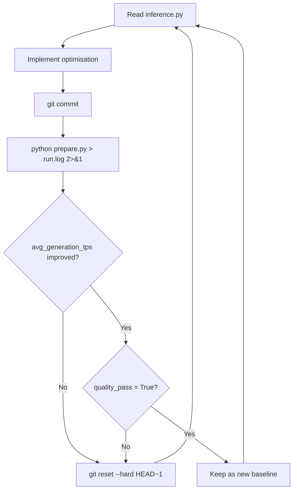

# SelfOptimizer-Inference

An autonomous agent that optimises LLM inference throughput on Apple Silicon, inspired by [karpathy/autoresearch](https://github.com/karpathy/autoresearch).

You point an AI coding agent at this repo and let it run. The agent hill-climbs on generation tokens/sec by modifying `inference.py`, with git commits as experiment tracking and `prepare.py` as the fixed evaluation harness it cannot touch.


## Repository Layout

| File | Purpose | Agent-editable |
|---|---|---|
| `inference.py` | MLX generation pipeline. Exposes `generate(model, tokenizer, prompt)` | **Yes** |
| `prepare.py` | Evaluation harness. Loads model, runs benchmarks, enforces quality gates | No |
| `results.tsv` | Experiment log maintained by the agent (gitignored) | Yes |

## Benchmark Results

All experiments below were run with Claude Opus 4.6 (via Claude Code) on a **MacBook Pro M4, 24GB RAM**. Each evaluation pass runs 5 benchmark prompts across 3 averaged runs, with 2 warmup passes (one short prompt for basic Metal kernel compilation, one actual benchmark prompt to prime kernels for real sequence lengths).

### 🟠 Qwen2.5-0.5B-Instruct-4bit

**Model** [`mlx-community/Qwen2.5-0.5B-Instruct-4bit`](https://huggingface.co/mlx-community/Qwen2.5-0.5B-Instruct-4bit) (0.5B params, 4-bit quantised)
**Experiments** 11 total, 2 kept, 9 reverted

| Metric | Baseline | Optimised | Change |
|---|---|---|---|
| `avg_generation_tps` | 398.41 | 441.63 | **+10.9%** |
| `avg_prompt_tps` | 2,714.32 | 2,648.17 | -2.4% |
| `avg_peak_memory_gb` | 0.544 | 0.544 | 0% |
| `avg_perplexity` | 5.92 | 5.98 | +1.0% |
| `sanity_check` | 0.80 | 0.80 | 0% (4/5 tasks pass) |
| `quality_pass` | True | True | -- |

<details>
<summary>Full experiment log (Qwen2.5-0.5B-Instruct-4bit)</summary>

| # | Experiment | gen_tps | prompt_tps | ppl | sanity | Decision | Notes |
|---|---|---|---|---|---|---|---|
| 0 | **Baseline** (stream_generate, temp=0.7, top_p=0.9) | 398.41 | 2,714.32 | 5.92 | 0.80 | -- | Starting point |
| 1 | Argmax sampling (temp=0.0, top_p=1.0) | **441.98** | 2,586.70 | 5.98 | 0.80 | **KEEP** | +10.9%, deterministic output, no sampling diversity |
| 2 | Metal cache limit 1GB | 440.82 | 2,558.14 | 5.98 | 0.80 | REVERT | No improvement over exp1 (-0.3%) |
| 3 | Prefill step size 512 | 442.06 | 2,811.45 | 5.98 | 0.80 | REVERT | Within noise (+0.02%), smaller chunks add kernel launch overhead |
| 4 | 8-bit KV cache quantisation | 370.19 | 2,120.36 | 4.51 | **0.40** | REVERT | **Sanity gate failed** (2/5 tasks). Perplexity alone (4.51) would have passed |
| 5 | List join instead of string concat | 442.31 | 2,557.28 | 5.98 | 0.80 | REVERT | Within noise (+0.07%), no meaningful difference |
| 6 | 4-bit KV cache quantisation | 374.52 | 2,046.89 | 597.82 | **0.20** | REVERT | **Both gates failed**. Perplexity 597, only 1/5 tasks pass |
| 7 | Rotating KV cache 1024 tokens | 439.74 | 2,833.59 | 5.98 | 0.80 | REVERT | Slightly worse (-0.5%), model loses context beyond 1024 tokens |
| 8 | Disable Python GC during generation | 442.14 | 2,766.88 | 5.98 | 0.80 | REVERT | Within noise (+0.04%), adds complexity for no gain |
| 9 | Prefill step size 4096 | 441.49 | 2,791.73 | 5.98 | 0.80 | REVERT | Within noise (-0.1%), larger chunks use more peak memory |
| 10 | Minimal code, singleton sampler, inline format, remove unused config | **441.63** | 2,648.17 | 5.98 | 0.80 | **KEEP** | Same speed, 42 fewer lines |
| 11 | MAX_TOKENS=128 | 444.35 | 2,612.04 | 6.37 | 0.80 | REVERT | Speed gain is artificial. Model does less work, not faster work |

</details>

### 🟠 Gemma-3-270m-it-4bit

**Model** [`mlx-community/Gemma-3-270m-it-4bit`](https://huggingface.co/mlx-community/Gemma-3-270m-it-4bit) (270M params, 4-bit quantised)
**Experiments** 8 total, 2 kept, 6 reverted

| Metric | Baseline | Optimised | Change |
|---|---|---|---|
| `avg_generation_tps` | 491.86 | 506.73 | **+3.0%** |
| `avg_prompt_tps` | 3,398.41 | 3,494.22 | **+2.8%** |
| `avg_peak_memory_gb` | 0.218 | 0.218 | 0% |
| `avg_perplexity` | 7.34 | 7.61 | +3.7% |
| `sanity_check` | 0.80 | 0.80 | 0% (4/5 tasks pass) |
| `quality_pass` | True | True | -- |

<details>
<summary>Full experiment log (Gemma-3-270m-it-4bit)</summary>

| # | Experiment | gen_tps | prompt_tps | ppl | sanity | Decision | Notes |
|---|---|---|---|---|---|---|---|
| 0 | **Baseline** (stream_generate, temp=0.7, top_p=0.9) | 491.86 | 3,398.41 | 7.34 | 0.80 | -- | Starting point |
| 1 | Argmax sampling (temp=0.0, top_p=1.0) | **507.14** | 3,370.58 | 7.61 | 0.80 | **KEEP** | +3.1%, deterministic output, no sampling diversity |
| 2 | Metal cache limit 1GB | 506.23 | 3,358.24 | 7.61 | 0.80 | REVERT | Within noise (-0.2%), memory tuning does not help at this scale |
| 3 | 8-bit KV cache quantisation | 472.08 | 3,089.75 | 7.61 | 0.60 | REVERT | -6.9% speed, quant/dequant overhead exceeds bandwidth savings |
| 4 | 4-bit KV cache quantisation | 458.67 | 2,974.12 | 11.18 | **0.40** | REVERT | **Sanity gate failed** (2/5 tasks). Perplexity rose but the real problem was broken outputs |
| 5 | Rotating KV cache 1024 tokens | 506.91 | 3,385.40 | 7.61 | 0.80 | REVERT | Within noise (-0.04%), model forgets beyond window |
| 6 | Prefill step size 512 | 506.47 | 3,432.19 | 7.61 | 0.80 | REVERT | Within noise (-0.1%), smaller chunks add kernel launch overhead |
| 7 | Minimal code, singleton sampler, inline format, remove unused config | **506.73** | 3,494.22 | 7.61 | 0.80 | **KEEP** | Same speed, 42 fewer lines |

</details>

### Takeaways

1. **Argmax sampling is the single biggest win.** +10.9% on Qwen2.5-0.5B-Instruct-4bit, +3.1% on Gemma-3-270m-it-4bit. Nucleus sampling (top-p) has real per-token overhead. The trade-off is deterministic output with no diversity.

2. **KV cache quantisation hurts, and the sanity check catches failures that perplexity misses.** On Qwen2.5-0.5B-Instruct-4bit, 8-bit KV dropped sanity to 0.40 (2/5 tasks pass) while perplexity stayed at 4.51, well under the 50.0 threshold. 4-bit was catastrophic with perplexity near 600 and sanity at 0.20. On Gemma, 4-bit KV similarly broke sanity even though perplexity remained in single digits. Architecture matters for quantization tolerance.

3. **The memory bandwidth wall is real.** The 270M model (~507 tok/s) and the 0.5B model (~442 tok/s) are both near the M4's bandwidth ceiling. Most experiments landed within measurement noise.

4. **Results are consistent across model families.** Qwen and Gemma show the same patterns. Argmax wins, KV quantization loses speed, config tuning is noise, simplification is free.

5. **Simplicity wins.** Removing 42 lines of unused config maintained the same speed on both models. Less code, less to review.

6. **MAX_TOKENS reduction is artificial.** The diff monitor correctly flagged this. Speed appeared to improve only because the model generated fewer tokens, not because it generated them faster.

## Agent Protocol

The evaluation harness (`prepare.py`) is locked. The implementation (`inference.py`) is open. An AI coding agent modifies `inference.py`, benchmarks it, and decides whether to keep or revert each change.



After each evaluation, `prepare.py` emits a diff report showing parameter changes and any tradeoff warnings:

```
[diff] changes from baseline:
  TEMP: 0.7 -> 0.0
[diff] tradeoff warnings:
  - Argmax decoding: no sampling overhead but deterministic output.
```

### Rules

1. **Only modify `inference.py`.** Never touch `prepare.py`.
2. **No new dependencies.** Only use packages already in `requirements.txt`.
3. **Quality gate is sacred.** If `quality_pass` is `False`, the experiment is reverted regardless of speed.
4. **Primary metric is `avg_generation_tps`.** Higher is better. Secondary target is lower `avg_peak_memory_gb`.
5. **Simplicity wins.** A small speed gain that adds 50 lines of complex code is not worth it. Removing code for equal or better performance is a great outcome.
6. **Be scientific.** Change one thing at a time when possible. Write clear commit messages.

### Search Space

The agent can modify anything in `inference.py`:

- **KV cache** - size limits, quantisation (4-bit/8-bit), group size
- **Sampling** - temperature, top-p, top-k, min-p, repetition penalty
- **Prefill** - step size (`PREFILL_STEP_SIZE`), memory management
- **Metal memory** - cache limits, buffer management
- **Architecture** - custom generate loops via `mlx_lm.utils.generate_step`, speculative decoding, prompt caching
- **Compilation** - `mx.compile` for kernel fusion, `mx.async_eval` for pipelining

### Optimisation Ideas

These are starting points. The agent generates its own ideas as well.

**Quick wins** - set `TEMP = 0.0` for argmax sampling, tune `PREFILL_STEP_SIZE` (512, 1024, 4096), set `MAX_KV_SIZE` to a fixed value, reduce `MAX_TOKENS` if quality holds

**Medium effort** - enable KV cache quantisation (`KV_BITS = 4` or `8`), tune `METAL_CACHE_LIMIT`, batch-friendly prompt formatting, pre-compile sampling functions with `mx.compile`

**Advanced** - custom generate loop bypassing `stream_generate`, speculative decoding with a draft model, prompt caching for shared prefixes, custom attention via `mx.fast.scaled_dot_product_attention`

## Evaluation Protocol

`prepare.py` defines a fixed benchmark protocol with 5 prompts covering different inference patterns:

| Prompt | Tests |
|---|---|
| Transformer architecture explanation | Sustained decode speed, concept recall |
| Compiler optimization summary (LLVM) | Prefill speed (long input, short output), domain knowledge |
| Train speed problem (correct answer: 48 km/h) | Arithmetic reasoning under constrained generation |
| Silicon and electricity poem | Creative generation, multi-line output |
| Longest common subsequence function | Structured code generation |

Each prompt has a corresponding sanity check that validates the content of the output, not just its statistical coherence.

### Metrics

| Metric | Target | Role |
|---|---|---|
| `avg_generation_tps` | Maximise | Primary optimisation target (decode tokens/sec) |
| `std_generation_tps` | -- | Standard deviation of generation TPS across all runs |
| `median_generation_tps` | -- | Median generation TPS (more robust to outliers than mean) |
| `avg_prompt_tps` | Maximise | Secondary (prefill tokens/sec) |
| `std_prompt_tps` | -- | Standard deviation of prompt TPS across all runs |
| `avg_peak_memory_gb` | Minimise | Secondary (Metal memory footprint) |
| `avg_perplexity` | < 50.0 | Quality gate for model-internal coherence |
| `avg_ttft_ms` | Minimise | Estimated time-to-first-token (prefill latency in ms) |
| `sanity_check` | >= 0.6 | Quality gate for task-level correctness |

### Quality Gates

An experiment is automatically reverted if **either** gate fails.

> [!IMPORTANT]
> The perplexity gate alone is not sufficient. In the experiment on Qwen2.5-0.5B-Instruct-4bit, 8-bit KV cache quantisation dropped sanity to 0.40 while perplexity stayed at 4.51. Without the sanity check, this broken configuration would have been kept.

- **Perplexity gate** (`avg_perplexity < 50.0`) catches catastrophic quality collapse. 4-bit KV quantization on Qwen2.5-0.5B-Instruct-4bit spiked perplexity to ~598.
- **Sanity check gate** (`sanity_check >= 0.6`) validates that outputs are actually correct. The math answer must contain "48", the transformer explanation must mention attention-related concepts, the code must contain a `def` statement with relevant identifiers.

## Setup

> [!NOTE]
> Requires macOS with Apple Silicon (M1 or later) and Python 3.10+. The Gemma 3 270M model needs roughly 2GB of free RAM.

```bash
pip install -r requirements.txt
```

### Running the benchmark manually

```bash
python prepare.py > run.log 2>&1
cat run.log
```

### Running with an AI agent

Point any AI coding agent (Claude Code, Kimi, Codex, etc.) at this repo. The agent reads the codebase, creates a branch, runs a baseline evaluation, and starts the optimisation loop. It keeps going until you stop it.

```bash
# Claude Code (pass the README as system prompt since it contains the agent protocol)
claude --system-prompt README.md
```

The agent only modifies `inference.py`, changes one thing at a time, never adds new dependencies, and runs indefinitely until interrupted.

### Notes

- The benchmark model is `mlx-community/Gemma-3-270m-it-4bit` (hardcoded in `prepare.py`)
- Each full evaluation takes ~2-5 minutes depending on configuration
- First run after model load includes Metal kernel compilation (handled by warmup)
- `results.tsv` is gitignored and used solely as the agent's experiment log
- Use `run.log` to debug crashes since it captures both stdout and stderr