# LLM Inference Pipeline 

> [!NOTE]
> This diagram illustrates the inference process of a **decoder-only** transformer model, typical for modern LLMs like GPT-series.

---

```mermaid
flowchart TD

    %% ============================================================
    %% INPUT PROCESSING
    %% ============================================================

    A["📄 Raw Text"]

    A --> B["<b>Text Normalization</b><br/>Unicode · whitespace · lowercasing"]

    B --> C["<b>Tokenizer</b><br/>BPE / WordPiece / Unigram"]

    C --> D["Token IDs"]

    D --> E["Prepend BOS Token<br/>+ register EOS id for stopping"]

    E --> F["Token Embedding Lookup"]

    F --> G["Token Embedding Vectors<br/>＋ Positional Encoding<br/>RoPE · ALiBi · Learned PE"]

    G --> H["Combined Input Embeddings"]

    %% ============================================================
    %% TRANSFORMER BLOCK
    %% ============================================================

    H ==> LN1

    subgraph BLOCK ["🔁 Transformer Block × N Layers"]
        direction TB

        %% --------------------------------------------------------
        %% ATTENTION
        %% --------------------------------------------------------

        subgraph ATTN ["Multi-Head Attention"]
            direction TB

            LN1["<b>Pre-LayerNorm</b><br/>RMSNorm / LayerNorm"]

            LN1 --> QKV["Linear Projections → Q, K, V"]

            QKV -.-> KVC[("<b>KV Cache</b><br/>Retrieve past K, V<br/>Append new K, V")]

            KVC ==> AS["<b>Attention Scores</b><br/>Q · Kᵀ / √d_k"]

            AS --> CM["Causal Mask Applied"]

            CM ==> SF1["Softmax"]

            SF1 --> AD["Attention Dropout<br/>(training only)"]

            AD ==> WS["Weighted Sum of V<br/>→ per-head output"]

            WS --> CH["Concatenate Attention Heads"]

            CH ==> OP["Output Projection W_O"]
        end

        %% --------------------------------------------------------
        %% RESIDUAL
        %% --------------------------------------------------------

        OP ==> RC1["Residual Connection<br/>x + attn_out"]

        %% --------------------------------------------------------
        %% FEED FORWARD
        %% --------------------------------------------------------

        subgraph FFN ["Feed-Forward Network (MLP)"]
            direction TB

            LN2["Pre-LayerNorm"]

            LN2 --> UP["Linear (up-projection)"]

            UP ==> ACT["<b>Activation</b><br/>GELU / SwiGLU / ReLU"]

            ACT --> DN["Linear (down-projection)"]

            DN --> DO["Dropout (training only)"]
        end

        RC1 ==> LN2

        DO ==> RC2["Residual Connection<br/>x + ffn_out"]

        RC2 --> UH["Updated Hidden States"]
    end

    %% ============================================================
    %% OUTPUT HEAD
    %% ============================================================

    UH ==> FH["<b>Final Hidden State</b><br/>last token position only"]

    FH --> FLN["Final LayerNorm"]

    FLN ==> LMH["<b>LM Head</b><br/>Linear Projection to Vocabulary Logits"]

    %% ============================================================
    %% LOGIT PROCESSING
    %% ============================================================

    LMH --> TS["Temperature Scaling<br/>logits ÷ T<br/>T < 1 sharpens · T > 1 flattens"]

    TS ==> LP["<b>Logit Processors</b><br/>Repetition penalty · Frequency penalty · Min-p · etc."]

    LP --> SF2["Softmax → Probability Distribution<br/>over Vocabulary"]

    %% ============================================================
    %% DECODING
    %% ============================================================

    SF2 --> DS{"Decoding<br/>Strategy"}

    DS -.-> GR["Greedy"]

    DS -.-> BS["Beam Search"]

    DS -.-> TK["Top-k"]

    DS -.-> TP["Top-p (Nucleus)"]

    GR ==> NT["Next Token Selected"]

    BS ==> NT

    TK ==> NT

    TP ==> NT

    %% ============================================================
    %% AUTOREGRESSIVE LOOP
    %% ============================================================

    NT --> EC{"EOS token or<br/>Max length reached?"}

    EC -- Yes --> STOP(["⏹ Stop Generation"])

    EC -- No --> AC["Append Token to Context"]

    AC ==>|"↺ loop — new token only<br/>prior K, V served from cache"| F

    %% ============================================================
    %% NODE STYLING
    %% ============================================================

    classDef input fill:#F3F1EB,stroke:#8A847C,color:#222222,stroke-width:1.8px,rx:14px,ry:14px

    classDef embed fill:#E6F1FB,stroke:#378ADD,color:#042C53,stroke-width:1.8px,rx:16px,ry:16px

    classDef block fill:#ECEBFF,stroke:#6B63D9,color:#211B59,stroke-width:1.8px,rx:18px,ry:18px

    classDef attn fill:#E2F7EF,stroke:#16926C,color:#032C24,stroke-width:1.8px,rx:18px,ry:18px

    classDef ffn fill:#F6E5C8,stroke:#A86400,color:#2B1700,stroke-width:1.8px,rx:18px,ry:18px

    classDef decode fill:#F8E5DE,stroke:#C24E26,color:#3A1408,stroke-width:1.8px,rx:18px,ry:18px

    classDef loop fill:#E5F2DA,stroke:#4E7D1B,color:#102A00,stroke-width:2.4px,rx:18px,ry:18px

    classDef stop fill:#FCEBEB,stroke:#D63B3B,color:#4A0F0F,stroke-width:2.4px,rx:20px,ry:20px

    classDef train fill:#F3F3F3,stroke:#A0A0A0,color:#555555,stroke-width:1.5px,stroke-dasharray:5 3,rx:16px,ry:16px

    classDef critical fill:#E9E4FF,stroke:#5B52CC,color:#160F4A,stroke-width:2.6px,rx:20px,ry:20px

    %% ============================================================
    %% CLASS ASSIGNMENTS
    %% ============================================================

    class A,B,C,D,E input
    class F,G,H embed

    class LN1,QKV,KVC,AS,CM,SF1,WS,CH,OP attn

    class AD,DO train

    class LN2,UP,ACT,DN ffn

    class RC1,RC2,UH block

    class FH critical
    class FLN,LMH input

    class TS,LP,SF2,DS,GR,BS,TK,TP,NT decode

    class EC,AC loop

    class STOP stop

    %% ============================================================
    %% COLORED LINK STYLING
    %% ============================================================

    linkStyle 0,1,2,3,4,5,6,7 stroke:#5B6478,stroke-width:2.2px

    linkStyle 8,10,11,12,14,15,16 stroke:#16926C,stroke-width:2.3px

    linkStyle 9 stroke:#2B7FFF,stroke-width:2px,stroke-dasharray:6 3

    linkStyle 18,19,20,21 stroke:#B86A00,stroke-width:2.2px

    linkStyle 17,22,23 stroke:#6B63D9,stroke-width:2.6px

    linkStyle 24,25,26 stroke:#A04BD9,stroke-width:2.4px

    linkStyle 27,28,29,30 stroke:#D96B2B,stroke-width:2px,stroke-dasharray:4 4

    linkStyle 31,32,33,34 stroke:#C24E26,stroke-width:2.4px

    linkStyle 35,36,37 stroke:#4E7D1B,stroke-width:3px

```

 

 

> [!IMPORTANT]
> 
> Please refer to the below legend for more context:
>
> | # | Visual Element | Meaning |
> |---|---|---|
> | 1 | `-->` Solid Arrow | Standard forward-pass computation |
> | 2 | `==>` Bold Arrow | High-signal data transformation |
> | 3 | `-.->` Dotted Arrow | Optional decoding branch |
> | 4 | Blue Dashed Arrow | KV cache retrieval/update path |
> | 5 | Gray Dashed Nodes | Training-only operations |
> | 6 | Purple Highlighted Nodes | Critical inference stages |
> | 7 | Green Nodes & Arrows | Autoregressive generation loop |
